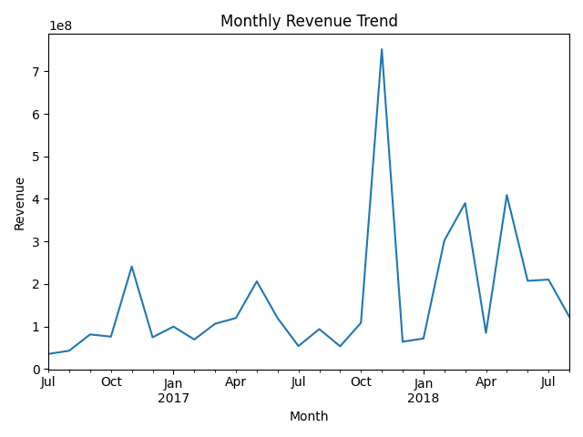
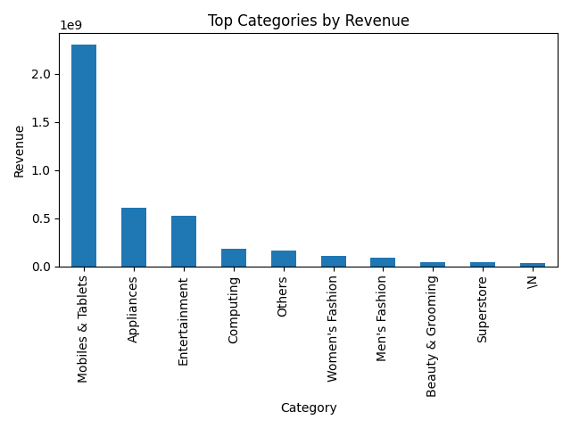
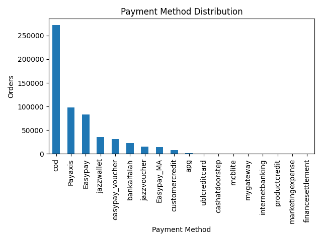

# E-commerce Sales Analysis on Pakistan dataset(Adrian Wachowicz)

## Goal
Analyze a large e-commerce transactions dataset to identify sales trends and customer/payment behavior.

## Dataset
Pakistan Largest Ecommerce Dataset (~500k transactions from years 2016–2018)

## What I used
Python, Pandas, Matplotlib

## What I did
- Created revenue metric (price × quantity)
- Analyzed monthly revenue trend
- Identified top product categories by revenue
- Analyzed payment method distribution

## Example Visualizations

### Monthly Revenue Trend

### Top Categories by Revenue

### Payment Method Distribution

## Insights
- Revenue varies over time, showing clear changes across months.
- A small number of categories generates a large share of total revenue.
- Payment methods are not evenly distributed, which can guide checkout and marketing decisions.
Dataset available on Kaggle. (Pakistan Largest Ecommerce Dataset)